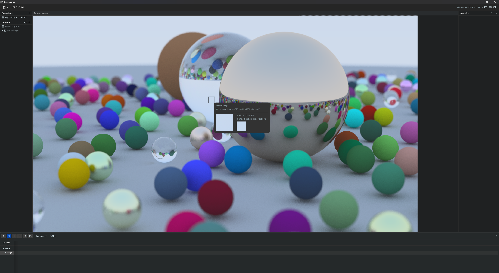

# Ray Tracing

This is my implementation of the [Ray Tracing in One Weekend](https://raytracing.github.io/v3/books/RayTracingInOneWeekend.html) book series with [ReRun](https://www.rerun.io/) as visualization tool.

## Building and Running

Copies of the source are provided for you to check your work and compare against. If you wish to build
the provided source, this project uses CMake. To build, go to the root of the project directory and
run the following commands to create the debug version of every executable:

    $ cmake -B build
    $ cmake --build build

## Running The Programs

On Linux or OSX, from the terminal, run like this:

    $ build/RayTracing

On Windows, run like this:

    build\debug\RayTracing

## Requirements

### ReRun

- **C++**: [Guide](https://www.rerun.io/docs/getting-started/cpp)
- **Python**: `pip install rerun-sdk` or on [`conda`](https://github.com/conda-forge/rerun-sdk-feedstock)
- **Rust**: `cargo add rerun`

## Future Development

- Complete book series.
- CUDA
- OptiX
